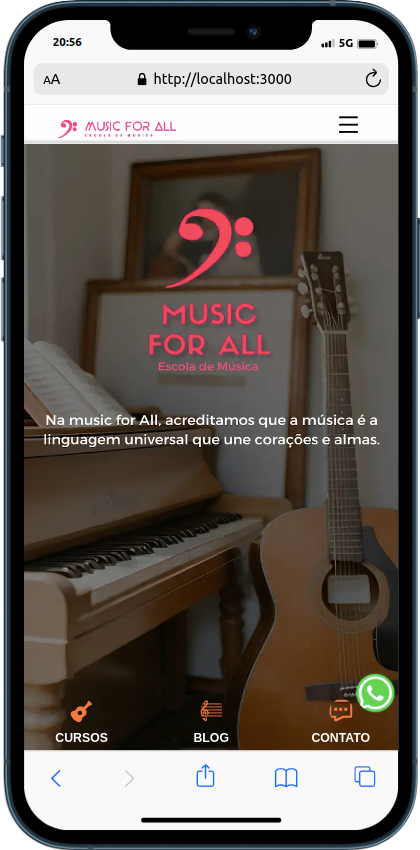
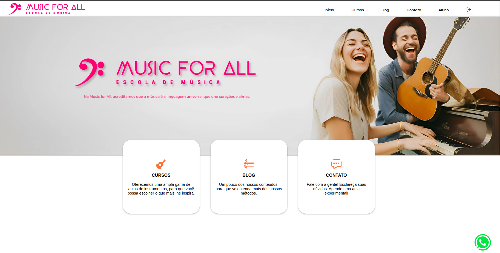
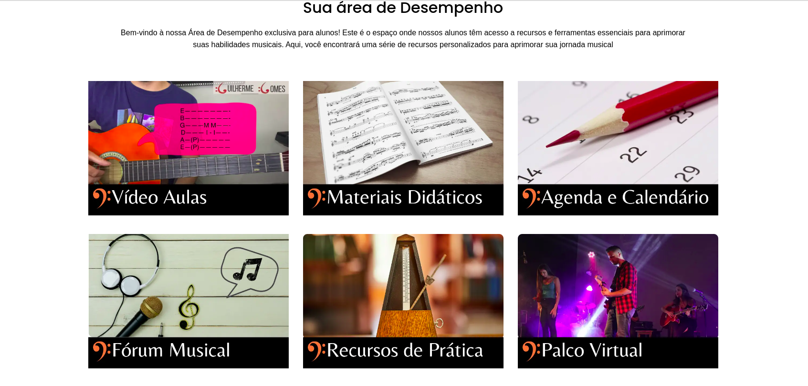
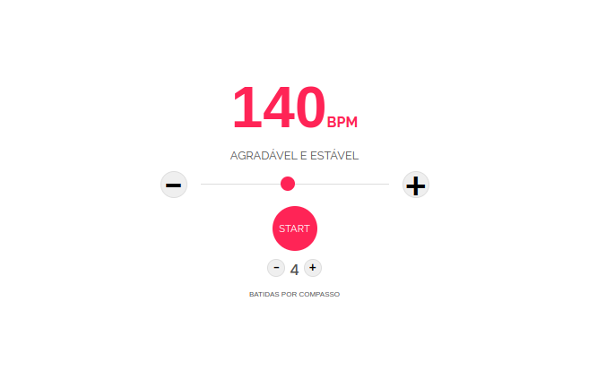

# Sobre o projeto
O projeto "Music For All" é uma plataforma online dedicada à música, que oferece uma variedade de recursos e informações para músicos de todos os níveis e interesses. Desenvolvido com tecnologias modernas, o site proporciona uma experiência atraente e interativa aos visitantes, permitindo que eles explorem cursos, agendem aulas e conheçam os benefícios da escola de música "Music For All". Além disso, o site oferece uma experiência mais aprofundada para alunos registrados, que podem fazer login e acessar conteúdos e ferramentas exclusivas, incluindo interação com postagens através de comentários e likes. Os alunos também têm acesso a um metrônomo integrado para aprimorar sua prática musical, além de vídeo aulas exclusivas. Com um design responsivo e imagens de alta qualidade, o site se destaca como uma fonte valiosa de informações musicais e um ponto de contato acessível para futuros músicos e entusiastas da música.

## Layout mobile
  
## Layout web

# Tecnologias utilizadas
### Next.js:
Framework React para construção de aplicações web.
### React:
Biblioteca JavaScript para criação de interfaces de usuário.
### CSS Modules:
Método de estilização em que as classes CSS são escopadas localmente em componentes React.

# Autor
Guilherme Gomes
https://www.linkedin.com/in/guilherme-gomes-427321238/
