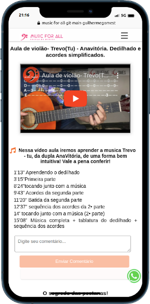
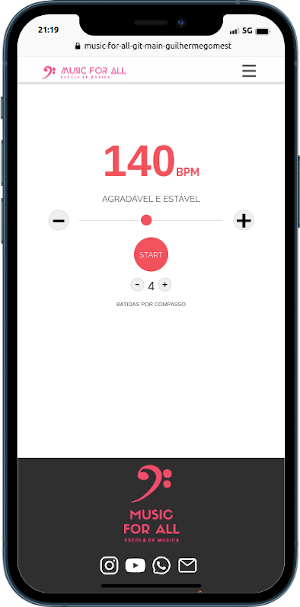

https://escolamusicforall.com.br/
# Sobre o projeto
. Implementação e manutenção de uma plataforma educacional interativa que permite aos visitantes explorar cursos,
agendar aulas e conhecer virtualmente a escola.
. Sistema de interação social, metrônomo digital, vídeo aulas e download de materiais para alunos autenticados
. Loja online, com uma API própria alcançando 100% de eficácia na gestão e vendas.
. Implementação de testes automatizados garantindo a qualidade do software e redução de erros.

## Layout mobile
     
## Layout web

# Tecnologias utilizadas
### Next.js:
### React
### CSS Modules
### React-Image
### React Icons
### FireBase 
### Cypress
### Node-js

# Autor
Guilherme Gomes
https://www.linkedin.com/in/guilherme-gomes-427321238/
